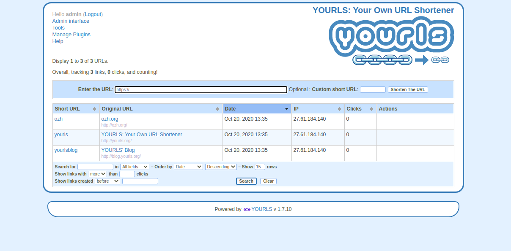

<!--
N.B.: This README was automatically generated by https://github.com/YunoHost/apps/tree/master/tools/readme_generator
It shall NOT be edited by hand.
-->

# Yourls for YunoHost

[](https://dash.yunohost.org/appci/app/yourls)  

[](https://install-app.yunohost.org/?app=yourls)

*[Lire ce readme en français.](./README_fr.md)*

> *This package allows you to install Yourls quickly and simply on a YunoHost server.
If you don't have YunoHost, please consult [the guide](https://yunohost.org/#/install) to learn how to install it.*

## Overview

YOURLS stands for Your Own URL Shortener. It is a small set of PHP scripts that will allow you to run your own URL shortening service (a la TinyURL or bitly).
Running your own URL shortener is fun, geeky and useful: you own your data and don't depend on third-party services. It's also a great way to add branding to your short URLs, instead of using the same public URL shortener everyone uses.

### Features

- Private (your links only) or Public (everybody can create short links, fine for an intranet)
- Dozens of plugins to easily implement new features
- Handy bookmarklets to easily shorten and share links
- Awesome stats: historical click reports, referrers tracking, visitors geo-location
- Developer API to integrate YOURLS into other applications
- Sample files to create your own public interface


**Shipped version:** 1.9.2~ynh4

**Demo:** https://yourls.org/cookie+

## Screenshots



## Documentation and resources

* Official app website: <https://yourls.org/>
* Official admin documentation: <https://docs.yourls.org/>
* Upstream app code repository: <https://github.com/YOURLS/YOURLS>
* YunoHost Store: <https://apps.yunohost.org/app/yourls>
* Report a bug: <https://github.com/YunoHost-Apps/yourls_ynh/issues>

## Developer info

Please send your pull request to the [testing branch](https://github.com/YunoHost-Apps/yourls_ynh/tree/testing).

To try the testing branch, please proceed like that.

``` bash
sudo yunohost app install https://github.com/YunoHost-Apps/yourls_ynh/tree/testing --debug
or
sudo yunohost app upgrade yourls -u https://github.com/YunoHost-Apps/yourls_ynh/tree/testing --debug
```

**More info regarding app packaging:** <https://yunohost.org/packaging_apps>